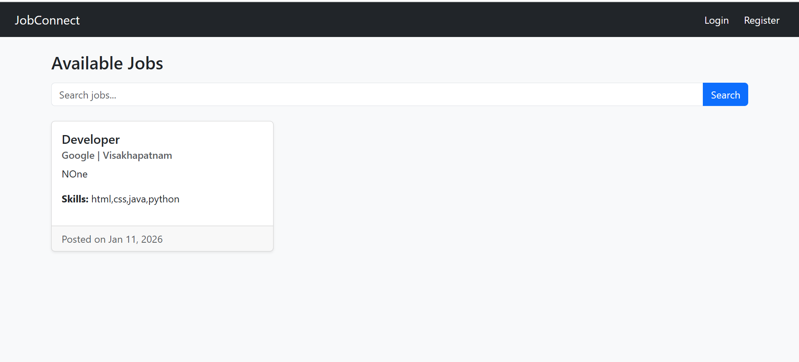
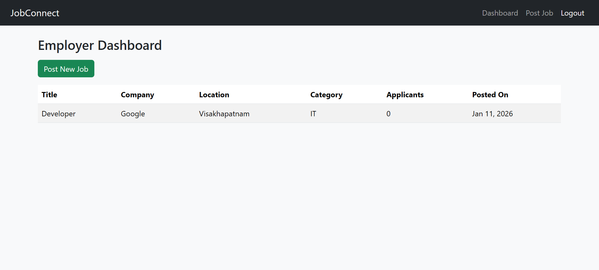
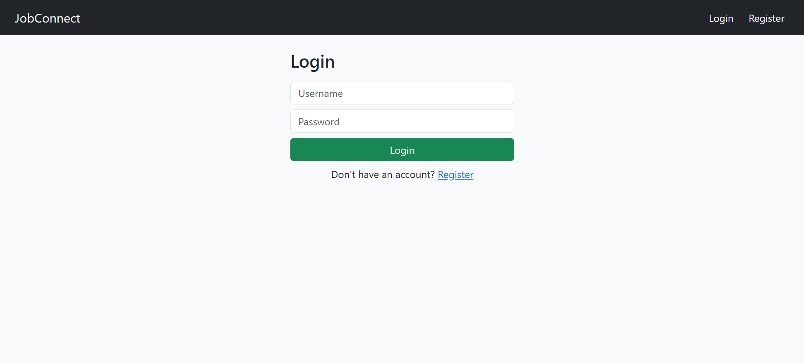

# JobConnect - Full-Stack Job Portal

**JobConnect** is a full-stack web application built with **Django** and **Bootstrap** that connects **job seekers** and **employers**.

---

## Features

- **Job Seekers:** Browse jobs, apply with resume upload, view application status.
- **Employers:** Post jobs, manage posted jobs, view applications.
- **Common:** Role-based authentication, responsive UI, media uploads.

---

## Tech Stack

- **Backend:** Django, Python  
- **Frontend:** HTML, CSS, Bootstrap 5  
- **Database:** SQLite / PostgreSQL  
- **Version Control:** Git & GitHub  

---

## Setup

```bash
git clone https://github.com/yourusername/JobConnect.git
cd JobConnect
python -m venv venv
# Windows
venv\Scripts\activate
# macOS/Linux
source venv/bin/activate
pip install -r requirements.txt
python manage.py migrate
python manage.py runserver

type nul > README.md
## Screenshots

**Home Page**  


**Post Job Page**  


**Employer Dashboard**  


**Seeker Dashboard**  


